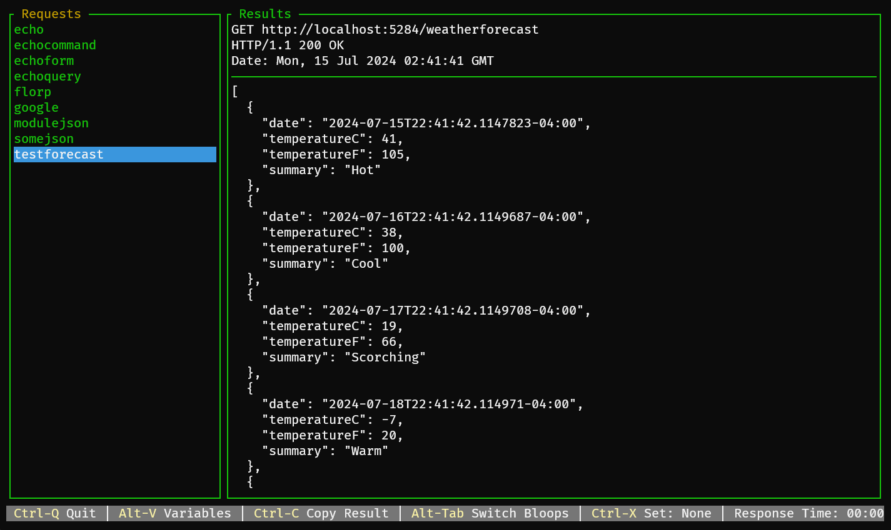

# Bloop GUI
When started with no arguments, bloop will open in terminal gui mode. When starting bloop as a gui, it will first look for an PATH separated style list of directories specified by `BLOOP_CONFIG_DIRS`. If that doesn't exist it will look in the current directory as well as directories specified in `.bloop.toml` in the user's home directory. This file can specify a list of directories that bloop configs are located. `bloop_directories = ["/home/treid/bloops", "/dev/null"]` etc

This ui tries to take the nano approach of just putting shortcut keys for all the more complicated actions at the bottom. The ui also responds to mouse events. Some of the shortcut key combos are iffy because different terminals swallow different combos. At some point this will be configurable. PRs welcome.
